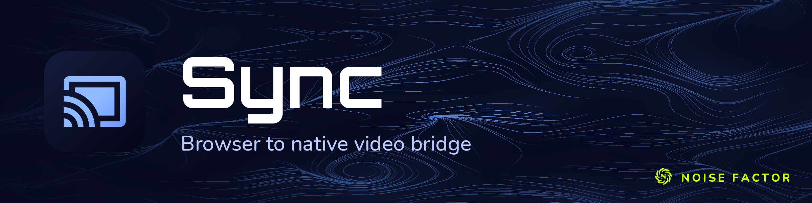

<!-- repo-hero -->
<a href="https://sync.noisedeck.app/"></a>

<sub>Open source from <a href="https://noisefactor.io">Noise Factor</a> &middot; <a href="https://github.com/noisefactorllc">more projects</a></sub>

# Sync

Sync is Noise Factor's low-latency bridge between browser renderers and native
video ecosystems. It carries GPU-rendered RGBA frames over authenticated
loopback WebSockets and republishes them through platform-native video-sharing
providers, allowing applications such as Noisedeck to appear in existing source
pickers without a custom plugin in every downstream host.

## Project status

Sync is under active development. This source tree currently includes:

- an independently versioned frame and control protocol;
- a browser SDK with bounded discovery, explicit pairing, and separate control
  and sender-data sockets;
- a native C++20 loopback daemon with per-origin, revocable authorization;
- bounded sender and connection ownership with non-blocking browser submission;
- a macOS Metal publisher and dynamically discovered Syphon integration;
- a Windows Spout publisher and a cross-platform NDI publisher, both
  dynamically discovered;
- an Apple Silicon menu-bar companion and a Windows tray companion, each with
  bounded helper supervision; and
- native, browser, protocol, security-boundary, and real-loopback tests.

Both companions are previews and are not ready for general use.
Reverse-direction native sources and automatic updates are not part of the
current public implementation.

## Known issues

Things that stop Sync from working today, with the workaround where one
exists. Please keep this list current: add an entry when a report is
diagnosed, remove it when the fix ships.

- **Content blockers block the loopback health request.** uBlock Origin,
  uBlock Origin Lite, and AdGuard ship EasyPrivacy and "block LAN" rules that
  stop public pages from reaching `127.0.0.1`; Chrome logs
  `net::ERR_BLOCKED_BY_CLIENT` and Noisedeck reports the companion absent.
  Workaround: set the blocker to no filtering on the Noisedeck origin.
- **Browsers require a loopback permission first.** Chrome 145+ and Firefox
  150+ gate `127.0.0.1` behind the `loopback-network` permission. The passive
  check stops at "Needs attention"; only Connect Sync can raise the browser's
  prompt. Noisedeck Standalone (Electron) grants it by default.
- **Sync Camera refuses the helper on 0.2.31 and earlier.** The CoreMediaIO
  sink client passed a NULL queue-altered proc, so an approved extension still
  reported "did not accept a connection". Fixed in 18e81ea; ships with the
  next preview release.
- **Copy Diagnostics reports "Sync 0.2.0" on 0.2.31 and earlier.** The menu
  bar and tray apps compiled a fallback version string. Fixed in 858a6fd.
- **The macOS approval row can lag a day behind the request.** System
  Settings > Privacy & Security > Security shows "System software from
  application "Sync" was blocked from loading" only for a live request; if
  it is missing, quit Sync, relaunch it from Applications, and reopen
  Settings.
- **The native pairing prompt defaults to Deny.** Pressing Return in the
  companion's pairing dialog denies the origin.
- **`syncd --list-pairings` and `--revoke-origin` must not run beside the
  app.** They open the pairing store directly and leave the running daemon
  unable to authenticate pairings until it restarts.
- **The Windows installer is not code-signed** and Windows warns about an
  unrecognised publisher; each release publishes a SHA-256 instead.

## Providers

Sync publishes through every provider that is available on the running
platform, at once: a single named output appears simultaneously as a Spout
sender and an NDI source on Windows. Receiving applications pick whichever
they support.

| Provider | Platform | Runtime | Bundled |
| --- | --- | --- | --- |
| Syphon | macOS | `Syphon.framework` | Yes — see [docs/dependencies/syphon.md](docs/dependencies/syphon.md) |
| Spout | Windows | `SpoutLibrary.dll` | Yes — see [docs/dependencies/spout.md](docs/dependencies/spout.md) |
| NDI | Windows, macOS | NDI Runtime | No — the SDK licence forbids redistribution; see [docs/dependencies/ndi.md](docs/dependencies/ndi.md) |
| Camera | macOS | Sync Camera extension, bundled in Sync.app | Yes — activated by Sync.app on first launch, approved once in System Settings |

The camera provider publishes a 1920×1080 BGRA stream as the "Sync Camera"
device, so any app that picks a camera can use it. While no sender is live
the camera shows a dark card reading "Sync: waiting for Noisedeck" rather
than a black picture. The extension ships inside
Sync.app; macOS activates it only for an app under /Applications, and asks the
user once. Sync.app restarts its helper when activation completes, which is
when the camera first appears in Noisedeck's provider list.

No provider is ever linked at build time. Each is discovered at run time
through its documented public entry point, and a provider whose runtime is
absent simply reports itself unavailable rather than failing the daemon. A
selected provider that ends up unavailable also prints one line to stderr
naming why, so `available: false` is never the whole diagnosis; the `ready`
record on stdout keeps its exact shape.

## Building the native daemon

Sync requires CMake 3.21 or newer, a C++20 compiler, OpenSSL 3, and libuv.
macOS builds also use the system Foundation and Metal frameworks and locate
libuv through pkg-config; Windows builds use MSVC and locate libuv and
OpenSSL through a CONFIG package such as vcpkg:

```powershell
vcpkg install libuv:x64-windows openssl:x64-windows
cmake -S . -B build -A x64 `
  -DCMAKE_TOOLCHAIN_FILE="$env:VCPKG_INSTALLATION_ROOT/scripts/buildsystems/vcpkg.cmake"
cmake --build build --config Release --target syncd
ctest --test-dir build --build-config Release --output-on-failure
```

MSVC is what CI builds and what the installer ships. The tree also builds and
passes its tests under MinGW-w64 (GCC), which needs no administrator rights
and is a practical local setup:

```bash
pacman -S --needed mingw-w64-x86_64-{gcc,cmake,ninja,openssl,libuv,pkgconf}
cmake -S . -B build -G Ninja && cmake --build build
ctest --test-dir build --output-on-failure
```

Run the tests from a shell with a Windows-shaped environment. An MSYS2 login
shell unsets `LOCALAPPDATA` and points `TMP`/`TEMP` at `/tmp`, and the pairing
store resolves its default path from `%LOCALAPPDATA%` and refuses a path that
is not drive-absolute, so several tests fail there for reasons unrelated to the
code.

```bash
cmake -S . -B build
cmake --build build --target syncd -j4
ctest --test-dir build --output-on-failure
```

The daemon binds only to IPv4 and IPv6 loopback. Production mode uses port
`53979` unless overridden:

```bash
./build/syncd
./build/syncd --port 54000
./build/syncd --list-pairings
./build/syncd --revoke-origin https://visuals.example
```

Naming no publisher selects every provider the platform offers. Naming one or
more restricts the daemon to exactly those, and each accepts an explicit
runtime path for development builds:

```bash
./build/syncd --publisher spout --publisher ndi
./build/syncd --publisher ndi --ndi-runtime /opt/ndi/lib
./build/syncd --publisher spout --spout-library C:/Spout/SpoutLibrary.dll
```

See the provider table above for each runtime and license boundary.

## Packaging the desktop previews

### macOS

Packaging requires macOS 13 or newer, an Apple Silicon build, `dylibbundler`,
`librsvg`, and a locally built `Syphon.framework`. The release workflow pins
Syphon source revision `71351d4b484cd2d1917867f7846a5cdca724552d`; use that
same revision for local release-equivalent packages.

```bash
cmake -S . -B build-package \
  -DSYNC_PRODUCT_VERSION=0.2.0 \
  -DSYNC_SYPHON_FRAMEWORK_PATH=/absolute/path/to/Syphon.framework
cmake --build build-package --target sync_macos_dmg -j4
SYNC_PACKAGE_DIR=build-package/package \
  node --test test/packaging/macos-package.test.js
scripts/smoke-macos-app.sh "$PWD/build-package/package/Sync.app"
```

The local target creates an unsigned app and DMG. Developer ID signing,
notarization, stapling, and public publication belong to the Noise Factor
release workflow so credentials never enter this public repository.

### Windows

Packaging requires Windows 10 or newer, an x64 MSVC toolchain, Inno Setup 6
(`ISCC` on `PATH`), ImageMagick (`magick` on `PATH`), and a locally built
`SpoutLibrary.dll`.

```powershell
cmake -S . -B build-package -A x64 `
  -DCMAKE_TOOLCHAIN_FILE="$env:VCPKG_INSTALLATION_ROOT/scripts/buildsystems/vcpkg.cmake" `
  -DSYNC_PRODUCT_VERSION=0.2.0 `
  -DSYNC_SPOUT_LIBRARY_PATH=C:\absolute\path\to\SpoutLibrary.dll `
  -DSYNC_WINDOWS_DEPENDENCY_PATH="$env:VCPKG_INSTALLATION_ROOT\installed\x64-windows\bin"
cmake --build build-package --config Release --target sync_windows_installer --parallel 4
$env:SYNC_PACKAGE_DIR = "build-package/package"
node --test test/packaging/windows-package.test.js
./scripts/smoke-windows-app.ps1 -Bundle "$PWD/build-package/package/Sync"
```

The local target creates an unsigned application directory and installer.
Authenticode signing and public publication likewise belong to the Noise
Factor release workflow.

## Browser SDK

The dependency-free browser modules live in [`browser/`](browser/). Passive
discovery never initiates pairing; `pair()` must be called from a deliberate
user action, and the host application owns returned token storage. See the
[browser client guide](browser/README.md) for the API and loopback Permissions
Policy requirements.

```js
import { SyncBridgeClient } from './browser/index.js'

const pairingClient = new SyncBridgeClient()
const { token } = await pairingClient.pair('My visual app')
pairingClient.close()

const sync = new SyncBridgeClient({ token })
await sync.connect()
```

## Tests

```bash
npm run test:browser
npm run test:packaging
SYNC_DAEMON_PATH=build/syncd npm run test:integration
ctest --test-dir build --output-on-failure
```

The memory soak streams 1080p frames through a test-receiver daemon while
cycling senders and probing health, and fails on footprint growth. Run it
against a Release build; a Debug daemon is too slow to be representative:

```bash
SYNC_DAEMON_PATH=build-release/syncd SYNC_SOAK_SECONDS=60 npm run test:soak
```

## Security

Unknown origins cannot silently publish. Pairing requires a browser-initiated
request and a visible native approval prompt; reusable credentials are scoped
to an exact normalized origin and can be revoked. Please report suspected
vulnerabilities privately using [SECURITY.md](SECURITY.md).

## License

Sync is released under the [MIT License](LICENSE). See
[TRADEMARK.md](TRADEMARK.md) for the branding boundary. Third-party runtime
providers retain their own licenses and are not relicensed by this repository.

Copyright © 2026 Noise Factor LLC
