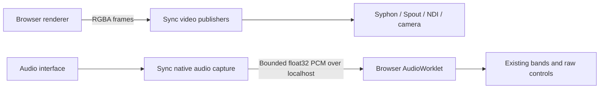

# Native audio input

## Status and relationship to video I/O

Sync's audio input work complements its video output. Video carries browser
frames to native receivers; audio carries native interface channels into a
browser. Both use the companion, localhost transport, and origin pairing.
Audio is implemented in SDK 0.3.0 and native companion source
[`1972af1ce3f0d14054f3693e250c668aff536884`](https://github.com/noisefactorllc/sync/commit/1972af1ce3f0d14054f3693e250c668aff536884).
That exact source passed the
[cross-platform CI matrix](https://github.com/noisefactorllc/sync/actions/runs/34803984585)
and the separate
[Windows camera end-to-end workflow](https://github.com/noisefactorllc/sync/actions/runs/34803984593).
[Native preview 0.2.68](https://sync.noisedeck.app/#download) and
[SDK 0.3.0](https://github.com/noisefactorllc/sync/releases/tag/sdk-v0.3.0)
are published from that source. The SDK and companion product versions are
independent. Check for a selected and available `audio` provider with direction
`receive`; do not infer audio support from a product or protocol version.
[Video protocol](protocol-v1.md),
[native capabilities](../native/src/main.cpp), [audio SDK methods](../browser/client.js).



The immediate requirement is **1–32 selectable channels per source**, preserving
channel identity and signed raw values. Hardware with fewer channels must expose
fewer choices. Receiving native video, native audio output, recording, network
audio distribution, and sample-accurate audio/video synchronization are separate
workstreams. The current audio format carries an audio frame cursor, not a
timestamp shared with video. [Capture contract](../native/include/sync/audio_capture.hpp),
[video timestamps](protocol-v1.md).

## Research findings

Source checks were refreshed on 2026-09-13. Chromium's restriction is
**path-dependent**, not a universal two-channel limit in Web Audio:

| Boundary | Evidence | Consequence |
| --- | --- | --- |
| Linux PulseAudio capture | `GetInputStreamParameters` constructs a stereo layout. [Chromium source](https://chromium.googlesource.com/chromium/src/+/main/media/audio/pulse/audio_manager_pulse.cc) | Asking this path for 32 channels does not make it open 32 hardware inputs. |
| Linux ALSA capture | Its input parameters also select stereo. [Chromium source](https://chromium.googlesource.com/chromium/src/+/main/media/audio/alsa/audio_manager_alsa.cc) | Changing the browser's Linux backend alone is insufficient. |
| macOS capture | It adopts the input device's channel layout only when the count is at most two; otherwise its initialized layout stays stereo. [Chromium source](https://chromium.googlesource.com/chromium/src/+/main/media/audio/mac/audio_manager_mac.cc) | A multichannel CoreAudio interface does not imply a multichannel browser track. |
| MediaStream → Web Audio | Chromium's sink separately initializes stereo parameters. [Chromium source](https://chromium.googlesource.com/chromium/src/+/main/third_party/blink/renderer/modules/mediastream/webaudio_media_stream_audio_sink.cc) | Even a genuinely wide track can lose channels at a later boundary. |
| Web Audio graph | Channel splitters and discrete channel interpretation support multichannel processing. [Web Audio specification](https://www.w3.org/TR/webaudio/#ChannelSplitterNode) | A worklet can supply the graph with the channels when capture is moved outside the restricted path. |

Noisedeck already requests an ideal channel count of 32 and disables echo
cancellation, noise suppression, and automatic gain control. Its existing
TrackProcessor-to-worklet bridge addresses the later MediaStream conversion
boundary. It cannot reconstruct channels discarded at capture. Constraints
describe desired or required track properties; they are not a bypass for an
implementation's native input choices. [Media Capture constraints](https://www.w3.org/TR/mediacapture-streams/#dom-mediatrackconstraintset-channelcount),
[Chromium capture source](https://chromium.googlesource.com/chromium/src/+/main/media/audio/pulse/audio_manager_pulse.cc).

The initial browser investigation also found that a synthetic
`MediaStreamAudioDestinationNode` fixture could hit an eight-channel ceiling.
That was a limit of that test route, not evidence that a worklet cannot expose
32 channels. The retained integration fixture avoids that route entirely:
it produces distinct native float values and sends them through the actual
daemon and SDK. Synthetic tests establish routing correctness, not compatibility
with a physical AudioFuse or another driver. [Native fixture](../native/test/audio_test_server.cpp),
[SDK channel-identity test](../test/browser/client.test.js).

A subsequent test also exercised the real JACK driver path: a separate JACK
client produced 32 distinct signed signals, the production RtAudio backend
opened it, and Noisedeck received every channel. This closes the native-driver
test gap for that software source; a physical interface remains a separate
qualification. [JACK source](../test/linux/jack-audio-source.cpp),
[acceptance result](reviews/evidence/2026-09-13/audio-jack.json).

## Alternatives considered

The judgments below concern the adoption problem: many independent hardware
inputs in a web application, including signed near-DC control signals.

| Approach | Assessment and decision |
| --- | --- |
| `channelCount`, splitters, worklets, disabling speech processing | Keep the existing improvements. They solve graph and processing problems but cannot restore channels lost in native capture. [Capture constraints](https://www.w3.org/TR/mediacapture-streams/#dom-mediatrackconstraintset-channelcount), [Chromium sink](https://chromium.googlesource.com/chromium/src/+/main/third_party/blink/renderer/modules/mediastream/webaudio_media_stream_audio_sink.cc). |
| Firefox or another browser engine | Worth a hardware compatibility matrix and correcting overly broad stereo fallback assumptions. A browser recommendation alone leaves Chromium and Electron adoption unresolved. Browser-specific fallback work remains separate from native capture. [Web Audio contract](https://www.w3.org/TR/webaudio/). |
| Many mono/stereo virtual devices | Viable specialist workaround when the OS graph exposes separate endpoints. Costs include setup, repeated capture sessions, naming, and clock alignment. It does not give one source 32 channels. PipeWire can instead host a native JACK client directly. [PipeWire JACK compatibility](https://pipewire.pages.freedesktop.org/pipewire/page_man_pw-jack_1.html). |
| Plain Electron wrapper | Keeping the same Chromium capture path keeps its limits. A native addon could bypass it, but only for desktop users; Sync can support both web and desktop through one adapter. [Chromium capture source](https://chromium.googlesource.com/chromium/src/+/main/media/audio/mac/audio_manager_mac.cc). |
| Chromium patch or fork | Technically possible, but capture and the later stream-to-graph conversion both need attention. Maintaining browser builds and distributing a dedicated browser is a larger ongoing commitment. Keep upstream work as a parallel possibility, not the dependency for adoption. [Capture](https://chromium.googlesource.com/chromium/src/+/main/media/audio/pulse/audio_manager_pulse.cc), [sink](https://chromium.googlesource.com/chromium/src/+/main/third_party/blink/renderer/modules/mediastream/webaudio_media_stream_audio_sink.cc). |
| Native analysis → small control messages | Attractive optimization: send band levels and raw statistics at visual-frame cadence. Deferred because it duplicates browser analysis semantics and removes access to the original samples. PCM keeps one current analysis implementation. [PCM contract](../native/include/sync/audio_capture.hpp). |
| Native PCM → Sync → AudioWorklet | Selected. Bypasses hardware capture restrictions while reusing installation, pairing, SDK transport, and browser analysis. [Native backend](../native/src/audio_native.cpp), [audio worker](../native/src/server.cpp). |
| DAW plugin → Sync | Potential second producer: export envelopes, control voltages, or stems directly from a user's DAW. Useful when a DAW owns an interface exclusively, but requires plugin distribution and host validation. The native input abstraction leaves room for another producer. [Backend interface](../native/include/sync/audio_capture.hpp). |
| WebUSB audio driver in JavaScript | Not a general escape hatch: the WebUSB specification protects the USB Audio interface class. A device-specific vendor interface would be a separate hardware integration. [WebUSB protected interfaces](https://wicg.github.io/webusb/#protected-interface-classes). |
| WebRTC, encoded media, or signal multiplexing into stereo | These still need an unrestricted producer. Encoding or packing control signals introduces additional fidelity, clock, and recovery work; it has no advantage for the first localhost PCM implementation. The chosen protocol keeps finite signed float32 samples. [Encoder](../native/src/audio_capture.cpp). |

## Implemented design

### Native capture and dependencies

RtAudio 6.0.1 is pinned to commit
`b4f04903312e0e0efffbe77655172e0f060dc085`, with the source archive verified by
SHA-256. It provides the OS audio access; Sync owns the capture lifetime,
protocol, buffering, and browser integration. The MIT-style RtAudio notice is
included in the platform package notices. [Build definition](../CMakeLists.txt),
[upstream source and license](https://github.com/thestk/rtaudio/tree/b4f04903312e0e0efffbe77655172e0f060dc085).

| Platform | Backend path | Current evidence and remaining qualification |
| --- | --- | --- |
| macOS | CoreAudio; explicit OS microphone permission and audio-input entitlement | The exact source passed macOS build, native, JavaScript, packaging, and loopback CI. Retained discovery listed the built-in microphone as one channel at 48 kHz. No new physical capture or signed installed permission result has been recorded. [CI run](https://github.com/noisefactorllc/sync/actions/runs/34803984585), [recorded inventory](reviews/evidence/2026-09-13/audio-input.json), [permission implementation](../native/src/platform/macos/audio_permission.mm), [helper entitlement](../packaging/macos/SyncAudio.entitlements). |
| Linux | ALSA plus JACK when its development library is present; release build installs both | The Ubuntu 24.04 x86_64 release job passed build, tests, package verification, and 32-channel 48 kHz native probes through isolated JACK and PipeWire via `pw-jack`. The final JACK probe validated 94,208 frames; the PipeWire probe validated 95,168. Both reported zero mismatches, cursor discontinuities, and dropped frames. These were software sources, not physical AudioFuse hardware. Direct ALSA can contend with another owner. [Retained evidence](reviews/evidence/2026-09-14/audio-qualification.json), [CI job](https://github.com/noisefactorllc/sync/actions/runs/34803984585/job/103852091230), [pw-jack](https://pipewire.pages.freedesktop.org/pipewire/page_man_pw-jack_1.html). |
| Windows | WASAPI in the initial default build | The exact source passed hosted Windows build, native, JavaScript, packaging, installed-app lifecycle, and real-loopback gates. The separate Windows camera end-to-end job also passed, but its real audio inventory contained no sources, so selected-source capture was skipped and WASAPI capture remains unqualified. ASIO is not enabled by default; its integration and distribution terms require a separate decision. [Retained evidence](reviews/evidence/2026-09-14/audio-qualification.json), [cross-platform CI](https://github.com/noisefactorllc/sync/actions/runs/34803984585), [camera workflow](https://github.com/noisefactorllc/sync/actions/runs/34803984593), [RtAudio build options](https://github.com/thestk/rtaudio/blob/b4f04903312e0e0efffbe77655172e0f060dc085/CMakeLists.txt), [Steinberg licensing](https://www.steinberg.net/developers/asiosdk-open/). |

The backend opens the first `min(inputChannels, 32)` channels at the device's
reported current or preferred sample rate. It does not select physical channels
33–34 or provide an arbitrary input map. Source IDs hash backend plus device
name. Because RtAudio does not expose a persistent hardware UID here, duplicate
names within one backend are omitted instead of guessed. Renaming or replacing
an interface is not yet a fully solved identity problem. [Enumeration and opening](../native/src/audio_native.cpp).

The protocol-v1 capability catalog is limited to four entries for compatibility
with released video SDKs. Normal platform defaults leave room for audio. If an
advanced CLI invocation explicitly selects all four video providers, Sync keeps
those selections and disables audio with a diagnostic. Omit the video provider
that the current platform cannot implement, or use the default invocation, to
make room for audio. [Registration guard](../native/src/main.cpp),
[regression test](../test/integration/loopback.test.js).

### Linux JACK through PipeWire

Install PipeWire's JACK compatibility package, then run Sync through `pw-jack`.
For the installed user service, create an explicit override:

```sh
sudo apt install pipewire-jack
systemctl --user edit noisedeck-sync
```

Enter this unit override:

```ini
[Service]
ExecStart=
ExecStart=/usr/bin/pw-jack /usr/bin/syncd
```

Apply it and restart Sync:

```sh
systemctl --user daemon-reload
systemctl --user restart noisedeck-sync
```

For an interactive diagnostic instead, stop the existing user service and run
`pw-jack syncd` in a terminal. `pw-jack` selects PipeWire's JACK compatibility
library for that process. Installing `pipewire-jack` does not change which JACK
library an already-running Sync service loaded; use `pw-jack` unless the system
JACK library has been replaced explicitly. Sync does not switch the backend
automatically. [PipeWire JACK wrapper](https://pipewire.pages.freedesktop.org/pipewire/page_man_pw-jack_1.html),
[Linux service unit](../packaging/linux/noisedeck-sync.service).

### Buffering, clocks, and ownership

The callback writes interleaved float32 into a fixed 4,096-frame ring. It does
not allocate or wait for a mutex. If the consumer holds the lock, the callback
drops that block; overflow drops the oldest frames. Samples with nonfinite
values become zero. The packet cursor and cumulative drop count let the browser
discard queued data across discontinuities. Driver-reported overflow currently
fails the capture; automatic recovery is not implemented.
[Ring buffer](../native/src/audio_capture.cpp), [driver callback](../native/src/audio_native.cpp).

Each audio client connection owns one native capture. Separate connections
allow independent devices and avoid sharing Noisedeck's video control queue.
The server dispatches device operations through libuv workers and keeps one
audio job in flight per connection. A close during an outstanding open retains
the connection object until worker cleanup finishes. The browser pulls packets;
the daemon does not push an unbounded stream into a slow socket.
[Server lifecycle](../native/src/server.cpp).

The browser converts interleaved samples into transferable planar arrays and
feeds the existing Noisedeck AudioWorklet. Its native bridge uses a 4,096-frame
ring and a 512-frame prefill. AudioContext rate must match the incoming rate;
this path does not implement resampling or shared-clock synchronization.
At 48 kHz, the prefill alone is about 10.7 ms, not an end-to-end latency result.
The PCM payload rate for 32 channels is `32 × 48,000 × 4 = 6,144,000` bytes/s,
before framing. Measure CPU, allocation, latency, and simultaneous video load
before claiming production performance. [SDK decoder](../browser/client.js),
[audio format bounds](../native/include/sync/audio_capture.hpp).

### Wire format

The audio extension uses these authenticated `/control` requests:

```json
{"type":"listAudioSources"}
{"type":"openAudioSource","sourceId":"audio_..."}
{"type":"readAudioSource","sourceId":"audio_..."}
{"type":"closeAudioSource","sourceId":"audio_..."}
```

Discovery returns `audioSources` with `id`, `name`, `channelCount`, and
`sampleRate`. Open returns `audioSourceOpened` with the actual format. Close
returns `audioSourceClosed`. Read returns a binary packet; errors remain bounded
JSON. An open has a 60-second SDK deadline to accommodate OS permission.
Ordinary reads keep the configured control deadline. One client must not try to
read or close another connection's capture. [Parser and response encoders](../native/src/control.cpp),
[SDK](../browser/client.js).

| Offset | Size | Meaning |
| --- | --- | --- |
| 0 | 4 bytes | ASCII `NAUD` |
| 4 | uint16 | Packet version, currently 1 |
| 6 | uint16 | Channel count, 1–32 |
| 8 | uint32 | Sample rate |
| 12 | uint32 | Frame count, 0–480 |
| 16 | uint64 | First frame cursor |
| 24 | uint64 | Cumulative dropped frames |
| 32 | `frames × channels × 4` bytes | Interleaved float32 PCM |

Numbers are little-endian. The maximum packet is 61,472 bytes, below the
server's 64 KiB queued-write limit even with WebSocket framing. The SDK keeps
uint64 cursors as BigInt and rejects inconsistent lengths, unsupported formats,
and nonfinite incoming samples. [Wire encoder and tests](../native/test/audio_capture_test.cpp),
[decoder tests](../test/browser/client.test.js).

### Noisedeck integration

The audio automation UI adds **Connect Sync audio**, then lists native devices
with a `Sync` suffix. Native IDs use the `sync-audio:` prefix. Compiled audio
requirements still decide which captures run. A native source bypasses
`getUserMedia`; stopping its final consumer closes its client and device.
The existing channel picker derives its choices from the actual count.
The current Sync SDK source and Noisedeck source
`3ac22df8a8dcc5450bee25e48350a200137bbb96` use audio snapshot `0.3.0`.
Preview deployment, HTTP and browser smoke, promotion, and the production
deployment passed. A production byte check matched all 29 changed application
files to that source, and the post-promotion health job passed.
Noisedeck's existing video snapshot remains `0.1.5` and independently versioned.
Integration files are
`app/js/features/syncAudioInput.js`, `app/js/features/audioInput.js`,
`app/js/ui/automationPanel.js`, and `tests/sync-audio-input.spec.js`.
The [retained qualification record](reviews/evidence/2026-09-14/audio-qualification.json)
describes the seven local fixture cases without requiring access to the private
Noisedeck source.

### Permission boundary

Persisted video-origin tokens do not automatically authorize audio. Production
audio discovery and capture require an explicit successful pairing in the
current daemon lifetime, using prompt wording that includes audio inputs.
The in-memory approval cache holds at most 64 origins. After a daemon restart,
pair again for audio; ordinary video token authentication still works. A future
persisted per-capability grant model may improve this experience, but must keep
the same consent boundary. [Server gate](../native/src/server.cpp),
[restart/renewal integration test](../test/integration/loopback.test.js).

## Release qualification matrix

This matrix separates source readiness from released artifact and hardware
claims. Update each pending row only from a retained result.
The [2026-09-14 qualification record](reviews/evidence/2026-09-14/audio-qualification.json)
preserves the earlier local results and adds the exact-source CI runs, final
x86_64 JACK/PipeWire probes, empty Windows audio inventory, and 30-second SDK
0.3.0 route through Chromium and Noisedeck. The browser run validated 1,480,640
frames with zero mismatches and 1,024 reported dropped frames.

| Gate | Current result | Release requirement |
| --- | --- | --- |
| SDK 0.3.0 | Package manifest and runtime version are 0.3.0. Exact source `1972af1ce3f0d14054f3693e250c668aff536884` passed the full cross-platform CI matrix. Current local totals are 153 SDK/package tests, 247 JavaScript unit tests, 22 macOS native groups, and 30 macOS real-loopback tests. The tarball, modules ZIP, and checksum file were published as `sdk-v0.3.0` on September 14, 2026. | Keep capability checks in consuming applications because SDK and companion versions are independent. [SDK release](https://github.com/noisefactorllc/sync/releases/tag/sdk-v0.3.0), [CI run](https://github.com/noisefactorllc/sync/actions/runs/34803984585), [retained evidence](reviews/evidence/2026-09-14/audio-qualification.json). |
| Noisedeck audio integration | Source `3ac22df8a8dcc5450bee25e48350a200137bbb96` passed 902 Node tests with one existing skip and ten browser tests: the seven standalone synthetic fixture cases plus three credential-coexistence cases covering video-to-audio token propagation, pending fresh audio consent without losing video recovery, and stale consent failure after a newer credential. A focused set of 89 output and credential tests also passed. Independent review reported no remaining findings. Preview deployment, HTTP and browser smoke, promotion, production deployment, and post-promotion health passed. Production metadata identified merge `2df3966f48ba6fbd931f9a41c262826c375db5ba`, and all 29 changed application files matched the source byte for byte. The new three cases test credential behavior; they do not add physical, production-driver, or sustained combined-load evidence. | Qualify installed native-to-Noisedeck capture on each available interface; the synthetic fixture suite cannot certify hardware. [Retained code, test, and deployment record](reviews/evidence/2026-09-14/audio-qualification.json). |
| macOS CoreAudio | One built-in microphone was listed as one channel at 48 kHz; this was discovery, not a new physical capture test. | Test a signed installed bundle, denied and revoked permission, and physical multichannel input. [Recorded inventory](reviews/evidence/2026-09-13/audio-input.json). |
| Linux ALSA/JACK | The exact-source Ubuntu 24.04 x86_64 release job passed package verification and both final 32-channel, 48 kHz signed-pattern probes: JACK validated 94,208 frames and PipeWire via `pw-jack` validated 95,168, both with zero mismatches, cursor discontinuities, or drops. The current 30-second Chromium/Noisedeck software-source run validated 1,480,640 frames with zero mismatches and 1,024 native-ring drops; native video was not running. The September 13 result with 1,088 drops is retained only as historical evidence. | Keep physical interface claims and combined audio/video claims pending. [CI job](https://github.com/noisefactorllc/sync/actions/runs/34803984585/job/103852091230), [current evidence](reviews/evidence/2026-09-14/audio-qualification.json), [historical JACK evidence](reviews/evidence/2026-09-13/audio-jack.json). |
| Windows WASAPI | Exact-source hosted Windows build/runtime gates passed, and the physical Windows camera end-to-end gate passed separately. The retained WASAPI inventory was empty; no audio source was opened and no WASAPI PCM capture passed. | Record a non-empty endpoint inventory and capture its opened channel count, sample rate, signed samples, discontinuities, and drops before making a Windows audio compatibility claim. [Cross-platform CI](https://github.com/noisefactorllc/sync/actions/runs/34803984585), [camera workflow](https://github.com/noisefactorllc/sync/actions/runs/34803984593), [retained evidence](reviews/evidence/2026-09-14/audio-qualification.json). |
| Physical AudioFuse | A suitable host has been requested; no physical capture result is recorded. | Record the host audio profile, opened format, numbered input identity, signed raw behavior where supported, and selector isolation. |
| Simultaneous audio and video | Not established by the retained JACK run. | Measure channel identity, discontinuities, ring drops, CPU, memory, and video delivery under sustained combined load. [Video verification approach](reviews/2026-09-10-interoperability.md). |
| Public release | Native preview 0.2.68 and SDK 0.3.0 are published from exact source `1972af1ce3f0d14054f3693e250c668aff536884`; immutable and rolling installer URLs plus both SDK packages returned HTTP 200 with their expected sizes and SHA-256 hashes. Noisedeck source `3ac22df8a8dcc5450bee25e48350a200137bbb96` passed preview deployment, HTTP and browser smoke, promotion, production deployment, and post-promotion health. All 29 changed production application files matched that source byte for byte. | Physical audio and combined audio/video remain separate requirements before broad hardware or production-performance claims. [Download page](https://sync.noisedeck.app/#download), [SDK release](https://github.com/noisefactorllc/sync/releases/tag/sdk-v0.3.0), [retained byte and test proof](reviews/evidence/2026-09-14/audio-qualification.json). |

## Verification and limits of the evidence

The [recorded validation results](reviews/evidence/2026-09-13/audio-input.json)
retain test totals, browser version, native build environments, the earlier
`0.2.0-audio.0` development snapshot verification, and the hardware inventory
available during that work. This historical snapshot name is evidence
attribution, not the current SDK version.

The current automated checks exercise native buffering, strict parsing,
channel identity, SDK decoding, and the real localhost daemon-to-browser route.
Current local totals are 153 SDK/package tests, 247 JavaScript unit tests,
22 macOS native test groups, and 30 macOS real-loopback tests, all passing.
[Native test definitions](../CMakeLists.txt),
[loopback tests](../test/integration/loopback.test.js),
[browser tests](../test/browser/client.test.js),
[current record](reviews/evidence/2026-09-14/audio-qualification.json).

The seven local Noisedeck browser cases used the standalone
`sync_audio_test_server`, not the production companion or a hardware driver.
Four cases checked 1, 2, 8, and 32 distinct fixture channels. The other three
checked independent sources, ownership plus close during a slow open, and a
missing source failing without browser-microphone fallback. They establish the
Noisedeck-to-SDK fixture behavior only. [Fixture](../native/test/audio_test_server.cpp),
[retained case list](reviews/evidence/2026-09-14/audio-qualification.json).

Exact source `1972af1ce3f0d14054f3693e250c668aff536884` passed all eleven jobs in
the cross-platform CI matrix. The Ubuntu 24.04 x86_64 release job retained the
final real JACK and PipeWire software-source captures and verified the Debian
package. The separate Windows camera job passed camera end-to-end, enumerated
zero audio inputs, and therefore skipped selected-source audio capture. These
results do not certify released installers, physical 32-channel hardware,
WASAPI capture, signed macOS audio permission, or a long-running audio/video
session. [Cross-platform CI](https://github.com/noisefactorllc/sync/actions/runs/34803984585),
[Windows camera CI](https://github.com/noisefactorllc/sync/actions/runs/34803984593),
[retained CI evidence](reviews/evidence/2026-09-14/audio-qualification.json).

The retained JACK acceptance test passed in an Ubuntu 24.04 ARM64 container
with Chromium 148.0.7778.96 on the macOS host. The production capture backend
opened 32 channels at 48 kHz. All 32 selector choices were correct; signed raw
values were checked once per second during the 30-second run and matched every
time. It validated 1,479,072 received frames
across all channels with zero mismatched packets. The native ring reported
1,088 dropped frames, so this result does **not** establish uninterrupted or
sample-accurate delivery. Native video was not running during this check.
[Exact results and environment](reviews/evidence/2026-09-13/audio-jack.json),
[acceptance assertions](../test/acceptance/native-audio-jack.mjs).

The first container-relay experiment delivered only 130,560 frames over roughly
12 seconds and reported 434,144 dropped frames; the worklet repeatedly reset
and never reached the expected raw values. The relay used 8 KiB transfer chunks
with Nagle enabled. Repeating with 64 KiB chunks and `TCP_NODELAY` on both relay
sockets passed. Sync already enables `TCP_NODELAY` on accepted connections;
the correction was confined to the test relay. This is also evidence that
transport scheduling must be measured, even when native channel identity is
correct. [Failed diagnostic](reviews/evidence/2026-09-13/audio-jack-relay-diagnostic.json),
[passing test](reviews/evidence/2026-09-13/audio-jack.json),
[server socket setup](../native/src/server.cpp).

Reproduce the core checks from the Sync checkout:

```sh
cmake -S . -B build
cmake --build build -j 4
ctest --test-dir build --output-on-failure --timeout 30
node --test --test-timeout=30000 test/browser/*.test.js test/packaging/*.test.js
node --test --test-timeout=30000 test/integration/loopback.test.js
```

For the browser integration, build `sync_audio_test_server`, then run
`npx playwright test tests/sync-audio-input.spec.js --project=chromium --workers=1`
from the Noisedeck checkout. Set `SYNC_AUDIO_TEST_SERVER` if Sync is not a sibling
checkout. The tests also require the Noisemaker source checkout for AudioState.

### Reproduce the native JACK acceptance test

Use an isolated Linux environment with JACK 2 and its development library,
alongside the normal Sync build dependencies. Build the production daemon and
the standalone JACK source from the Sync checkout:

```sh
cmake -S . -B build -DCMAKE_BUILD_TYPE=Release
cmake --build build --target syncd -j 4
c++ -std=c++20 -Wall -Wextra -Werror test/linux/jack-audio-source.cpp -ljack -pthread -o build/sync-jack-source
```

Start each of these foreground commands in its own terminal in that isolated
environment. Serve Noisedeck on the browser's host; when everything runs on
Linux, all four commands run there:

```sh
# JACK server
jackd --no-realtime --port-max 128 -d dummy -r 48000 -p 1024

# Numbered native source
./build/sync-jack-source

# Production capture backend with isolated test authentication
./build/syncd --port 48991 --test-origin http://127.0.0.1:8000 --test-token audio-test-token --publisher ndi

# Noisedeck files, assuming sibling checkouts
python3 -m http.server --bind 127.0.0.1 --directory ../noisedeck/app 8000
```

The NDI runtime is not required for this audio test. The daemon reports that
video provider unavailable while its native audio backend remains usable.
Do not use `--test-receiver`, which takes a different initialization path.
[Daemon initialization](../native/src/main.cpp).

From the Sync checkout on the browser host, run:

```sh
node test/acceptance/native-audio-jack.mjs
```

The script resolves Playwright from Noisedeck's installed dependencies and uses
the sibling Noisemaker source for AudioState. Set `NOISEDECK_ROOT` or
`NOISEMAKER_ROOT` for other checkout locations. It requires the exact isolated
source name, verifies every received channel after startup, checks all raw
values once per second for 30 seconds, and verifies that deselection clears the
active input state. Authentication
uses the fixture token; pairing consent has separate integration coverage.
Stop the test processes after the run. [Test implementation](../test/acceptance/native-audio-jack.mjs),
[pairing coverage](../test/integration/loopback.test.js).

When the daemon runs inside Docker and the browser runs on its host, retain
Sync's loopback binding. The recorded test used a relay bound only to the
container's interface on the same port, with Docker publishing
`127.0.0.1:48991:48991`. Its `socat` settings were a 65,536-byte buffer and
`nodelay` on both TCP sockets. This relay is test infrastructure; a normal
installation runs the browser and Sync on the same host.
[Recorded environment](reviews/evidence/2026-09-13/audio-jack.json).

## Release milestones and next qualification

Completed for the public preview:

1. Exact source `1972af1ce3f0d14054f3693e250c668aff536884`
   passed the cross-platform source matrix, x86_64 JACK/PipeWire probes, native
   package gates, macOS physical video gates, Windows camera gate, and Ubuntu
   installed virtual-camera acceptance. The retained Windows audio inventory
   was empty, and none of the physical video or virtual-camera gates exercised
   native audio. [Qualification evidence](reviews/evidence/2026-09-14/audio-qualification.json).
2. Native preview 0.2.68 and SDK 0.3.0 were published. Public byte checks matched
   the expected size and SHA-256 for all immutable and rolling installers plus
   both SDK packages. [Download page](https://sync.noisedeck.app/#download),
   [SDK release](https://github.com/noisefactorllc/sync/releases/tag/sdk-v0.3.0),
   [retained byte proof](reviews/evidence/2026-09-14/audio-qualification.json).
3. Noisedeck source `3ac22df8a8dcc5450bee25e48350a200137bbb96`
   passed preview deployment, HTTP and browser smoke, promotion, and production
   deployment. A live byte check matched all 29 changed application files to
   that source, and post-promotion health passed. [Retained deployment proof](reviews/evidence/2026-09-14/audio-qualification.json).

The next actions qualify broader claims; they were not prerequisites for this
public preview:

1. **Qualify installed audio.** Exercise installed native-to-Noisedeck capture
   on available interfaces; the seven synthetic fixture cases and three
   credential cases are not hardware or combined-load acceptance.
2. **Run physical audio interfaces.** On the requested AudioFuse host and other
   available platform devices, record the backend and actual opened format.
   Feed distinguishable signals to inputs 1, 2, 3, 8, 16, and 32, then sweep
   every exposed channel. Acceptance means the selected input alone changes its
   bound control. [Channel identity assertions](../test/browser/client.test.js).
3. **Exercise installed consent, recovery, and combined load.** Verify fresh
   audio pairing, token rotation, reconnect, daemon restart, source disappearance,
   and cleanup.
   Combined audio and video load was qualified on 2026-09-18 in
   [research-2026-09-18-combined-audio-video](https://sync.noisedeck.app/performance/research-2026-09-18-combined-audio-video/).
   A continuous 30-minute soak under concurrent 32-channel float32 audio capture
   (48 kHz, 1,536,000 samples/s) and uncompressed 1080p60 video delivery (497.7 MB/s)
   demonstrated zero audio drops, zero cursor discontinuities, nominal 59.8+ delivered
   video FPS, and flat ~12.5 MB resident memory. Native daemon event loop optimizations
   (NEON/SSE2 SIMD unmasking, decoupled lock hold in `CaptureBuffer`, and sampled frame hashing)
   eliminated event loop starvation.
   Windows WASAPI architecture and virtual camera parity were qualified in
   [research-2026-09-18-windows-platform-parity](https://sync.noisedeck.app/performance/research-2026-09-18-windows-platform-parity/).
   [Server authentication](../native/src/server.cpp),
   [JACK baseline](reviews/evidence/2026-09-13/audio-jack.json),
   [video verification approach](reviews/2026-09-10-interoperability.md).
4. **Update compatibility claims from retained results.** Publish only the
   backend, device, channel, permission, recovery, and combined-load claims that
   their recorded tests support. Keep ordinary browser capture available for
   users who do not need native audio input.
